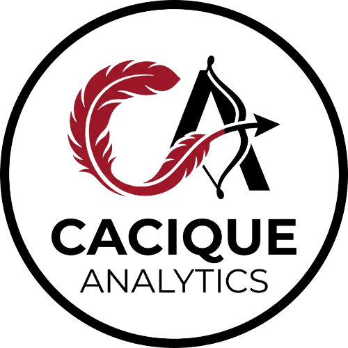

<p align="center">
  
</p>

<h1 align="center">CaciqueAnalytics</h1>

<p align="center">
  <strong>End-to-end data pipeline for Chilean football analytics</strong><br>
  <em>Scrape. Analyze. Automate. Export.</em>
</p>

<p align="center">
  
  
  
  
</p>

---

## What is this?

CaciqueAnalytics scrapes player and match data from SofaScore, processes it through a **fully automated ETL pipeline**, stores it in PostgreSQL, and exports structured JSON with **percentiles, plain-text context, and ML-powered player similarity** — ready for infographic design in Canvas, Figma, or Photoshop.

**It's a complete data engineering project built for football content creators who need stats fast, not SQL queries.**

```
SofaScore API --> ETL Pipeline --> PostgreSQL --> Data Layers --> JSON Export
                      |
              Automation Layer (detect matchdays, trigger scrapes, notify)
                      |
              ML Engine (player similarity via cosine similarity)
```

---

## Quick Start

```powershell
git clone https://github.com/Bryan-Alegria/CaciqueAnalytics.git
cd CaciqueAnalytics
python -m venv venv
.\venv\Scripts\Activate.ps1
pip install -r requirements.txt
cp .env.example .env   # Configure PostgreSQL credentials
```

Start PostgreSQL, apply migrations, and you're ready:

```powershell
# Export player stats
python export_data.py jugador -n "Fernando Zampedri" -s 2026 -c 1

# Compare two players
python export_data.py comparar --j1 "Fernando Zampedri" --j2 "Daniel Castro" -s 2026 -c 1

# Leaderboards
python export_data.py tabla -s 2026 -c 1

# ML: find similar players
python export_data.py similares -n "Fernando Zampedri" -s 2026 -c 1 -t 5

# Run the automation cycle
python src/automation/scheduler.py --dry-run --season 1
```

---

## Screenshots

<!-- Add your infographic screenshots here after generating them with the HTML renderer
<p align="center">
  
  
</p>
-->

*(Screenshots coming soon — generate them with `src/infographics/html_renderer.py`)*

---

## Features

### Core Pipeline

| Phase | Status | What |
|-------|--------|------|
| DB Schema | Done | 16 tables, optimized indexes, 4 competitions tracked |
| ETL | Done | Scrape SofaScore, clean data, compute per90 stats, predict xG |
| Data Layers | Done | Structured JSON with percentiles and Spanish plain text |
| Automation | Done | Matchday detection, trigger, scheduler, Windows Task Scheduler |
| ML Analytics | Done | Player similarity engine (19 features, cosine similarity) |

### Data Layers (Phase 3)

Every export includes 5 layers with league context:

```json
{
  "layer_identity":     { "player_name": "Fernando Zampedri", "team": "Univ. Catolica", "team_colors": {...} },
  "layer_basic_stats":  { "matches": 14, "minutes": 1260, "goals": 11, "assists": 2 },
  "layer_key_stats":    { "goals": { "value": 11, "percentile": 100, "plain_text": "Elite - Goleador de alto nivel" } },
  "layer_derived_stats":{ "goals_per_90": 0.79, "minutes_per_goal": 114.5 },
  "layer_summary":      { "headline": "Fernando Zampedri - Universidad Catolica", "top_stat": { "value": 11, "label": "Goles" } }
}
```

**Context Engine tiers:** Elite (>95%), Destacado (>85%), Por Encima del Promedio (>70%), Promedio (>40%)

### Automation (Phase 4)

Detects matchdays automatically and triggers ETL runs:

- **MatchExtractor** — fetches fixtures from SofaScore (240 matches in DB)
- **GamedayDetector** — detects today's matches, finished matches, matchday completion
- **AutomationTrigger** — orchestrates full cycle: detect -> ETL -> export -> notify
- **Notifier** — console, Discord webhook, or Windows toast alerts
- **Windows Task Scheduler** integration via `scheduler.ps1`

### ML Player Similarity (Phase 5)

Finds players with similar statistical profiles using cosine similarity on 19 normalized per-90 features:

```
python export_data.py similares -n "Fernando Zampedri" -s 2026 -c 1 -t 5
```

```json
{
  "jugador_objetivo": "Fernando Zampedri",
  "total_jugadores_index": 251,
  "jugadores_similares": [
    { "nombre": "Sebastian Saez", "equipo": "Union La Calera", "similitud": 0.917 },
    { "nombre": "Justo Giani", "equipo": "Universidad Catolica", "similitud": 0.894 }
  ]
}
```

### HTML Renderer (Optional)

Auto-generate infographics with Playwright + Jinja2 (B/R Football inspired design):

```python
from src.infographics.html_renderer import HTMLRenderer
renderer = HTMLRenderer()
renderer.generate_player_card("Fernando Zampedri", season_year=2026, competition_id=1)
```

---

## Data Coverage

| Table | Count |
|-------|------:|
| players | 587 |
| teams | 18 |
| seasons | 5 |
| player_season_stats | 1,303 |
| matches | 240 |

| Competition | Season | Stats | Matches |
|-------------|--------|------:|--------:|
| Primera Division Chile | 2025 | 463 | — |
| Primera Division Chile | 2026 | 392 | 240 |
| Copa Libertadores | 2026 | 39 | — |
| Copa Sudamericana | 2026 | 61 | — |
| Copa de la Liga | 2026 | 348 | — |

**Data quality:** 0 NULLs in stat columns, 0 duplicates, 0 orphans, 100% xG coverage (RandomForest, CV MAE: 0.128)

---

## Project Structure

```
CaciqueAnalytics/
├── export_data.py              # CLI: jugador, comparar, tabla, similares
├── scheduler.ps1               # Windows Task Scheduler wrapper
├── AGENTS.md / CONTEXT.md      # Project conventions and state
├── PLAN.md                     # Full implementation plan (5 phases)
├── migrations/
│   ├── 001_schema_optimization.sql
│   ├── 002_add_sofascore_season_id.sql
│   └── 003_scrape_log.sql
├── src/
│   ├── config.py               # .env loader
│   ├── db/session.py           # PostgreSQL connection
│   ├── scraper/
│   │   ├── sofascore_client.py # LanusStats wrapper
│   │   └── position_classifier.py
│   ├── etl/
│   │   ├── extract.py          # Data extraction
│   │   ├── transform.py        # Clean + per90 + xG
│   │   ├── load.py             # Upsert to DB
│   │   ├── matches.py          # Match fixture extractor
│   │   └── orchestrator.py     # Pipeline runner
│   ├── data_layers/            # 9 files: modular JSON export system
│   │   ├── player_layer.py     # Single player
│   │   ├── comparison_layer.py # H2H
│   │   ├── leaderboard_layer.py# Top lists
│   │   ├── context_engine.py   # Percentiles + Spanish text
│   │   ├── stat_registry.py    # Central stat definitions
│   │   ├── queries.py          # Reusable SQL builders
│   │   ├── providers.py        # LeagueStats protocol
│   │   ├── colors.py           # Team color cache
│   │   └── base.py             # DB connectivity
│   ├── automation/             # Phase 4: scheduler, detector, trigger, notifier
│   │   ├── detector.py         # Gameday detection
│   │   ├── trigger.py          # Orchestrator with dry-run mode
│   │   ├── notifier.py         # Console / Discord / Windows
│   │   └── scheduler.py        # CLI entry point
│   ├── ml/
│   │   └── similarity.py       # Player similarity engine (Phase 5)
│   └── infographics/
│       ├── html_renderer.py    # Playwright + Jinja2 renderer
│       └── templates/          # HTML/CSS layouts
├── tests/                      # 70 tests (pytest)
│   ├── test_automation/        # Detector, trigger, notifier (19 tests)
│   ├── test_ml/                # Similarity engine (9 tests)
│   ├── test_etl/               # Transform + matches (12 tests)
│   ├── test_data_layers/       # Regression (14 tests)
│   ├── test_infographics/      # Renderer (7 tests)
│   └── test_scraper/           # Position classifier (6 tests)
└── Infographics/data/          # JSON exports (gitignored)
```

---

## Tech Stack

| Component | Technology |
|-----------|------------|
| Language | Python 3.12 |
| Database | PostgreSQL 18 |
| Scraping | LanusStats (SofaScore) |
| ML | scikit-learn (xG prediction + player similarity) |
| Rendering | Playwright + Jinja2 |
| Testing | pytest 9.0.3 (70 tests) |
| Automation | Windows Task Scheduler |

---

## Python API

```python
from src.data_layers import PlayerDataLayer, ComparisonDataLayer, LeaderboardDataLayer
from src.ml.similarity import SimilarityEngine

# Player export
layer = PlayerDataLayer("Fernando Zampedri", season_year=2026, competition_id=1)
data = layer.build_layers(); layer.close()

# H2H comparison
comp = ComparisonDataLayer("Fernando Zampedri", "Daniel Castro", 2026, 1)
data = comp.build_layers(); comp.close()

# Player similarity
engine = SimilarityEngine(season_year=2026, competition_id=1)
similar = engine.find_similar("Fernando Zampedri", top_n=5)
for p in similar:
    print(f"{p.name} - {p.similarity:.3f}")
```

---

## Roadmap

- [x] Phase 1: Database schema
- [x] Phase 2: Core ETL pipeline
- [x] Phase 3: Data layers + context engine
- [x] Phase 4: Automation (scheduler, detector, trigger, notifier)
- [x] Phase 5: ML player similarity engine

Next (optional): Streamlit web dashboard, match-level stat scraping, historical backfill (2021-2024), automated X posting.

---

## Contributing

Personal project. See `AGENTS.md` for development conventions. Issues and PRs welcome.

## License

MIT
